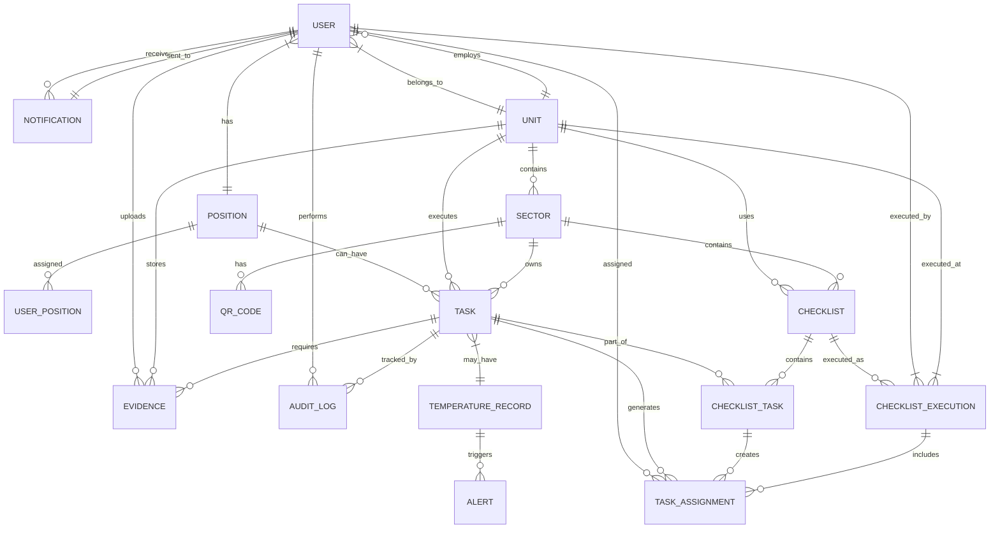

# Modelagem do Banco de Dados

## Diagrama ER Completo



## Estrutura das Tabelas SQL

### 1. Tabela: units (Unidades/Lojas)
```sql
CREATE TABLE units (
    id UUID PRIMARY KEY DEFAULT gen_random_uuid(),
    name VARCHAR(100) NOT NULL,
    code VARCHAR(20) UNIQUE NOT NULL,
    address TEXT,
    phone VARCHAR(20),
    email VARCHAR(100),
    cnpj VARCHAR(18),
    is_active BOOLEAN DEFAULT TRUE,
    created_at TIMESTAMP WITH TIME ZONE DEFAULT CURRENT_TIMESTAMP,
    updated_at TIMESTAMP WITH TIME ZONE DEFAULT CURRENT_TIMESTAMP,
    deleted_at TIMESTAMP WITH TIME ZONE
);

CREATE INDEX idx_units_code ON units(code);
CREATE INDEX idx_units_active ON units(is_active);
```

### 2. Tabela: positions (Cargos)
```sql
CREATE TABLE positions (
    id UUID PRIMARY KEY DEFAULT gen_random_uuid(),
    name VARCHAR(50) NOT NULL,
    description TEXT,
    permissions JSONB DEFAULT '[]'::jsonb,
    is_active BOOLEAN DEFAULT TRUE,
    created_at TIMESTAMP WITH TIME ZONE DEFAULT CURRENT_TIMESTAMP,
    updated_at TIMESTAMP WITH TIME ZONE DEFAULT CURRENT_TIMESTAMP
);

CREATE INDEX idx_positions_name ON positions(name);
```

### 3. Tabela: sectors (Setores)
```sql
CREATE TABLE sectors (
    id UUID PRIMARY KEY DEFAULT gen_random_uuid(),
    unit_id UUID REFERENCES units(id) ON DELETE CASCADE,
    name VARCHAR(50) NOT NULL,
    description TEXT,
    qr_code_data TEXT,
    is_active BOOLEAN DEFAULT TRUE,
    created_at TIMESTAMP WITH TIME ZONE DEFAULT CURRENT_TIMESTAMP,
    updated_at TIMESTAMP WITH TIME ZONE DEFAULT CURRENT_TIMESTAMP
);

CREATE INDEX idx_sectors_unit ON sectors(unit_id);
CREATE INDEX idx_sectors_name ON sectors(name);
```

### 4. Tabela: users (Usuários)
```sql
CREATE TABLE users (
    id UUID PRIMARY KEY DEFAULT gen_random_uuid(),
    unit_id UUID REFERENCES units(id) ON DELETE SET NULL,
    email VARCHAR(100) UNIQUE NOT NULL,
    password_hash VARCHAR(255) NOT NULL,
    full_name VARCHAR(100) NOT NULL,
    phone VARCHAR(20),
    avatar_url TEXT,
    role VARCHAR(20) NOT NULL CHECK (role IN ('admin', 'manager', 'employee')),
    is_active BOOLEAN DEFAULT TRUE,
    last_login TIMESTAMP WITH TIME ZONE,
    refresh_token VARCHAR(255),
    created_at TIMESTAMP WITH TIME ZONE DEFAULT CURRENT_TIMESTAMP,
    updated_at TIMESTAMP WITH TIME ZONE DEFAULT CURRENT_TIMESTAMP,
    deleted_at TIMESTAMP WITH TIME ZONE
);

CREATE INDEX idx_users_email ON users(email);
CREATE INDEX idx_users_unit ON users(unit_id);
CREATE INDEX idx_users_role ON users(role);
CREATE INDEX idx_users_active ON users(is_active);
```

### 5. Tabela: user_positions (Relação Usuário-Cargo)
```sql
CREATE TABLE user_positions (
    id UUID PRIMARY KEY DEFAULT gen_random_uuid(),
    user_id UUID REFERENCES users(id) ON DELETE CASCADE,
    position_id UUID REFERENCES positions(id) ON DELETE CASCADE,
    assigned_at TIMESTAMP WITH TIME ZONE DEFAULT CURRENT_TIMESTAMP,
    assigned_by UUID REFERENCES users(id),
    is_primary BOOLEAN DEFAULT FALSE,
    UNIQUE(user_id, position_id)
);

CREATE INDEX idx_user_positions_user ON user_positions(user_id);
CREATE INDEX idx_user_positions_position ON user_positions(position_id);
```

### 6. Tabela: tasks (Tarefas)
```sql
CREATE TYPE task_frequency AS ENUM ('once', 'daily', 'weekly', 'biweekly', 'monthly', 'custom');
CREATE TYPE task_priority AS ENUM ('low', 'medium', 'high', 'critical');
CREATE TYPE task_status AS ENUM ('pending', 'in_progress', 'completed', 'awaiting_approval', 'rejected', 'overdue');
CREATE TYPE photo_requirement AS ENUM ('none', 'optional', 'required', 'multiple');

CREATE TABLE tasks (
    id UUID PRIMARY KEY DEFAULT gen_random_uuid(),
    unit_id UUID REFERENCES units(id) ON DELETE CASCADE,
    sector_id UUID REFERENCES sectors(id) ON DELETE SET NULL,
    checklist_id UUID REFERENCES checklists(id) ON DELETE SET NULL,
    name VARCHAR(100) NOT NULL,
    description TEXT,
    category VARCHAR(50),
    priority task_priority DEFAULT 'medium',
    estimated_duration INTEGER, -- em minutos
    frequency task_frequency DEFAULT 'once',
    frequency_config JSONB, -- para frequências personalizadas
    start_date DATE,
    due_date DATE,
    due_time TIME,
    photo_requirement photo_requirement DEFAULT 'none',
    max_photos INTEGER DEFAULT 1,
    requires_temperature BOOLEAN DEFAULT FALSE,
    temperature_min DECIMAL(5,2),
    temperature_max DECIMAL(5,2),
    requires_signature BOOLEAN DEFAULT FALSE,
    requires_geolocation BOOLEAN DEFAULT FALSE,
    instructions TEXT,
    is_active BOOLEAN DEFAULT TRUE,
    is_global BOOLEAN DEFAULT FALSE,
    created_by UUID REFERENCES users(id),
    created_at TIMESTAMP WITH TIME ZONE DEFAULT CURRENT_TIMESTAMP,
    updated_at TIMESTAMP WITH TIME ZONE DEFAULT CURRENT_TIMESTAMP,
    deleted_at TIMESTAMP WITH TIME ZONE
);

CREATE INDEX idx_tasks_unit ON tasks(unit_id);
CREATE INDEX idx_tasks_sector ON tasks(sector_id);
CREATE INDEX idx_tasks_checklist ON tasks(checklist_id);
CREATE INDEX idx_tasks_status ON tasks(status);
CREATE INDEX idx_tasks_due_date ON tasks(due_date);
CREATE INDEX idx_tasks_active ON tasks(is_active);
```

### 7. Tabela: checklists (Checklists)
```sql
CREATE TYPE checklist_type AS ENUM ('opening', 'closing', 'cleaning', 'security', 'maintenance', 'custom');

CREATE TABLE checklists (
    id UUID PRIMARY KEY DEFAULT gen_random_uuid(),
    unit_id UUID REFERENCES units(id) ON DELETE CASCADE,
    sector_id UUID REFERENCES sectors(id) ON DELETE SET NULL,
    name VARCHAR(100) NOT NULL,
    description TEXT,
    type checklist_type DEFAULT 'custom',
    icon VARCHAR(50),
    color VARCHAR(7), -- hex color
    order_index INTEGER DEFAULT 0,
    is_active BOOLEAN DEFAULT TRUE,
    created_by UUID REFERENCES users(id),
    created_at TIMESTAMP WITH TIME ZONE DEFAULT CURRENT_TIMESTAMP,
    updated_at TIMESTAMP WITH TIME ZONE DEFAULT CURRENT_TIMESTAMP
);

CREATE INDEX idx_checklists_unit ON checklists(unit_id);
CREATE INDEX idx_checklists_sector ON checklists(sector_id);
CREATE INDEX idx_checklists_type ON checklists(type);
```

### 8. Tabela: checklist_tasks (Relação Checklist-Tarefa)
```sql
CREATE TABLE checklist_tasks (
    id UUID PRIMARY KEY DEFAULT gen_random_uuid(),
    checklist_id UUID REFERENCES checklists(id) ON DELETE CASCADE,
    task_id UUID REFERENCES tasks(id) ON DELETE CASCADE,
    order_index INTEGER NOT NULL,
    is_required BOOLEAN DEFAULT TRUE,
    UNIQUE(checklist_id, task_id),
    UNIQUE(checklist_id, order_index)
);

CREATE INDEX idx_checklist_tasks_checklist ON checklist_tasks(checklist_id);
CREATE INDEX idx_checklist_tasks_task ON checklist_tasks(task_id);
```

### 9. Tabela: task_assignments (Atribuições de Tarefa)
```sql
CREATE TABLE task_assignments (
    id UUID PRIMARY KEY DEFAULT gen_random_uuid(),
    task_id UUID REFERENCES tasks(id) ON DELETE CASCADE,
    user_id UUID REFERENCES users(id) ON DELETE SET NULL,
    position_id UUID REFERENCES positions(id) ON DELETE SET NULL,
    unit_id UUID REFERENCES units(id) ON DELETE CASCADE,
    scheduled_date DATE NOT NULL,
    scheduled_time TIME,
    status task_status DEFAULT 'pending',
    started_at TIMESTAMP WITH TIME ZONE,
    completed_at TIMESTAMP WITH TIME ZONE,
    approved_at TIMESTAMP WITH TIME ZONE,
    approved_by UUID REFERENCES users(id),
    rejection_reason TEXT,
    observations TEXT,
    geolocation_lat DECIMAL(10,8),
    geolocation_lng DECIMAL(11,8),
    digital_signature TEXT, -- base64 da assinatura
    signature_name VARCHAR(100),
    execution_time INTEGER, -- tempo real em minutos
    sla_met BOOLEAN,
    created_at TIMESTAMP WITH TIME ZONE DEFAULT CURRENT_TIMESTAMP,
    updated_at TIMESTAMP WITH TIME ZONE DEFAULT CURRENT_TIMESTAMP
);

CREATE INDEX idx_task_assignments_task ON task_assignments(task_id);
CREATE INDEX idx_task_assignments_user ON task_assignments(user_id);
CREATE INDEX idx_task_assignments_unit ON task_assignments(unit_id);
CREATE INDEX idx_task_assignments_status ON task_assignments(status);
CREATE INDEX idx_task_assignments_date ON task_assignments(scheduled_date);
CREATE INDEX idx_task_assignments_sla ON task_assignments(sla_met);
```

### 10. Tabela: evidence (Evidências/Fotos)
```sql
CREATE TABLE evidence (
    id UUID PRIMARY KEY DEFAULT gen_random_uuid(),
    task_assignment_id UUID REFERENCES task_assignments(id) ON DELETE CASCADE,
    task_id UUID REFERENCES tasks(id) ON DELETE CASCADE,
    user_id UUID REFERENCES users(id) ON DELETE SET NULL,
    unit_id UUID REFERENCES units(id) ON DELETE CASCADE,
    file_path VARCHAR(500) NOT NULL, -- caminho no R2
    file_name VARCHAR(255) NOT NULL,
    file_size INTEGER,
    mime_type VARCHAR(50),
    thumbnail_path VARCHAR(500),
    width INTEGER,
    height INTEGER,
    compression_quality INTEGER DEFAULT 80,
    caption TEXT,
    metadata JSONB, -- EXIF data, etc
    is_verified BOOLEAN DEFAULT FALSE,
    verified_by UUID REFERENCES users(id),
    verified_at TIMESTAMP WITH TIME ZONE,
    created_at TIMESTAMP WITH TIME ZONE DEFAULT CURRENT_TIMESTAMP
);

CREATE INDEX idx_evidence_task_assignment ON evidence(task_assignment_id);
CREATE INDEX idx_evidence_task ON evidence(task_id);
CREATE INDEX idx_evidence_user ON evidence(user_id);
CREATE INDEX idx_evidence_unit ON evidence(unit_id);
CREATE INDEX idx_evidence_created ON evidence(created_at);
```

### 11. Tabela: temperature_records (Registros de Temperatura)
```sql
CREATE TYPE temperature_type AS ENUM ('freezer', 'refrigerator', 'cold_room', 'oven', 'grill', 'other');

CREATE TABLE temperature_records (
    id UUID PRIMARY KEY DEFAULT gen_random_uuid(),
    task_assignment_id UUID REFERENCES task_assignments(id) ON DELETE CASCADE,
    unit_id UUID REFERENCES units(id) ON DELETE CASCADE,
    sector_id UUID REFERENCES sectors(id) ON DELETE SET NULL,
    temperature_type temperature_type NOT NULL,
    equipment_name VARCHAR(100),
    temperature_value DECIMAL(5,2) NOT NULL,
    min_allowed DECIMAL(5,2),
    max_allowed DECIMAL(5,2),
    is_within_range BOOLEAN GENERATED ALWAYS AS (
        temperature_value BETWEEN min_allowed AND max_allowed
    ) STORED,
    recorded_at TIMESTAMP WITH TIME ZONE DEFAULT CURRENT_TIMESTAMP,
    recorded_by UUID REFERENCES users(id),
    notes TEXT
);

CREATE INDEX idx_temperature_records_assignment ON temperature_records(task_assignment_id);
CREATE INDEX idx_temperature_records_unit ON temperature_records(unit_id);
CREATE INDEX idx_temperature_records_type ON temperature_records(temperature_type);
CREATE INDEX idx_temperature_records_date ON temperature_records(recorded_at);
CREATE INDEX idx_temperature_records_range ON temperature_records(is_within_range);
```

### 12. Tabela: alerts (Alertas)
```sql
CREATE TYPE alert_type AS ENUM ('temperature', 'overdue_task', 'pending_approval', 'checklist_not_done', 'rejected_task');
CREATE TYPE alert_status AS ENUM ('pending', 'acknowledged', 'resolved');

CREATE TABLE alerts (
    id UUID PRIMARY KEY DEFAULT gen_random_uuid(),
    unit_id UUID REFERENCES units(id) ON DELETE CASCADE,
    alert_type alert_type NOT NULL,
    title VARCHAR(200) NOT NULL,
    message TEXT NOT NULL,
    severity VARCHAR(20) DEFAULT 'medium' CHECK (severity IN ('low', 'medium', 'high', 'critical')),
    status alert_status DEFAULT 'pending',
    related_entity_type VARCHAR(50), -- 'task', 'temperature', 'checklist'
    related_entity_id UUID,
    acknowledged_by UUID REFERENCES users(id),
    acknowledged_at TIMESTAMP WITH TIME ZONE,
    resolved_by UUID REFERENCES users(id),
    resolved_at TIMESTAMP WITH TIME ZONE,
    created_at TIMESTAMP WITH TIME ZONE DEFAULT CURRENT_TIMESTAMP
);

CREATE INDEX idx_alerts_unit ON alerts(unit_id);
CREATE INDEX idx_alerts_type ON alerts(alert_type);
CREATE INDEX idx_alerts_status ON alerts(status);
CREATE INDEX idx_alerts_severity ON alerts(severity);
CREATE INDEX idx_alerts_created ON alerts(created_at);
```

### 13. Tabela: notifications (Notificações)
```sql
CREATE TYPE notification_channel AS ENUM ('push', 'email', 'whatsapp');
CREATE TYPE notification_status AS ENUM ('pending', 'sent', 'delivered', 'failed');

CREATE TABLE notifications (
    id UUID PRIMARY KEY DEFAULT gen_random_uuid(),
    user_id UUID REFERENCES users(id) ON DELETE CASCADE,
    title VARCHAR(200) NOT NULL,
    message TEXT NOT NULL,
    channel notification_channel NOT NULL,
    status notification_status DEFAULT 'pending',
    data JSONB, -- dados adicionais
    sent_at TIMESTAMP WITH TIME ZONE,
    delivered_at TIMESTAMP WITH TIME ZONE,
    read_at TIMESTAMP WITH TIME ZONE,
    created_at TIMESTAMP WITH TIME ZONE DEFAULT CURRENT_TIMESTAMP,
    retry_count INTEGER DEFAULT 0
);

CREATE INDEX idx_notifications_user ON notifications(user_id);
CREATE INDEX idx_notifications_status ON notifications(status);
CREATE INDEX idx_notifications_channel ON notifications(channel);
CREATE INDEX idx_notifications_created ON notifications(created_at);
```

### 14. Tabela: audit_logs (Logs de Auditoria)
```sql
CREATE TYPE audit_action AS ENUM ('create', 'update', 'delete', 'login', 'logout', 'upload', 'approve', 'reject', 'assign', 'reassign');

CREATE TABLE audit_logs (
    id UUID PRIMARY KEY DEFAULT gen_random_uuid(),
    user_id UUID REFERENCES users(id) ON DELETE SET NULL,
    action audit_action NOT NULL,
    entity_type VARCHAR(50) NOT NULL, -- 'user', 'task', 'checklist', etc
    entity_id UUID,
    old_values JSONB,
    new_values JSONB,
    ip_address INET,
    user_agent TEXT,
    device_info JSONB,
    unit_id UUID REFERENCES units(id) ON DELETE SET NULL,
    created_at TIMESTAMP WITH TIME ZONE DEFAULT CURRENT_TIMESTAMP
);

CREATE INDEX idx_audit_logs_user ON audit_logs(user_id);
CREATE INDEX idx_audit_logs_action ON audit_logs(action);
CREATE INDEX idx_audit_logs_entity ON audit_logs(entity_type, entity_id);
CREATE INDEX idx_audit_logs_unit ON audit_logs(unit_id);
CREATE INDEX idx_audit_logs_created ON audit_logs(created_at);
```

### 15. Tabela: sync_queue (Fila de Sincronização Offline)
```sql
CREATE TYPE sync_operation AS ENUM ('create', 'update', 'delete');

CREATE TABLE sync_queue (
    id UUID PRIMARY KEY DEFAULT gen_random_uuid(),
    user_id UUID REFERENCES users(id) ON DELETE CASCADE,
    device_id VARCHAR(100) NOT NULL,
    operation sync_operation NOT NULL,
    entity_type VARCHAR(50) NOT NULL,
    entity_data JSONB NOT NULL,
    local_timestamp TIMESTAMP WITH TIME ZONE NOT NULL,
    synced BOOLEAN DEFAULT FALSE,
    synced_at TIMESTAMP WITH TIME ZONE,
    error_message TEXT,
    retry_count INTEGER DEFAULT 0,
    created_at TIMESTAMP WITH TIME ZONE DEFAULT CURRENT_TIMESTAMP
);

CREATE INDEX idx_sync_queue_user ON sync_queue(user_id);
CREATE INDEX idx_sync_queue_device ON sync_queue(device_id);
CREATE INDEX idx_sync_queue_synced ON sync_queue(synced);
CREATE INDEX idx_sync_queue_created ON sync_queue(created_at);
```

### 16. Tabela: dashboard_cache (Cache para Dashboard)
```sql
CREATE TABLE dashboard_cache (
    id UUID PRIMARY KEY DEFAULT gen_random_uuid(),
    unit_id UUID REFERENCES units(id) ON DELETE CASCADE,
    cache_key VARCHAR(100) NOT NULL,
    cache_data JSONB NOT NULL,
    expires_at TIMESTAMP WITH TIME ZONE NOT NULL,
    created_at TIMESTAMP WITH TIME ZONE DEFAULT CURRENT_TIMESTAMP,
    updated_at TIMESTAMP WITH TIME ZONE DEFAULT CURRENT_TIMESTAMP,
    UNIQUE(unit_id, cache_key)
);

CREATE INDEX idx_dashboard_cache_unit ON dashboard_cache(unit_id);
CREATE INDEX idx_dashboard_cache_expires ON dashboard_cache(expires_at);
```

## Views para Relatórios

### View: vw_task_summary
```sql
CREATE VIEW vw_task_summary AS
SELECT 
    t.id AS task_id,
    t.name AS task_name,
    u.name AS unit_name,
    s.name AS sector_name,
    t.priority,
    t.frequency,
    COUNT(ta.id) AS total_assignments,
    COUNT(ta.id) FILTER (WHERE ta.status = 'completed') AS completed_count,
    COUNT(ta.id) FILTER (WHERE ta.status = 'pending') AS pending_count,
    COUNT(ta.id) FILTER (WHERE ta.status = 'overdue') AS overdue_count,
    COUNT(ta.id) FILTER (WHERE ta.sla_met = TRUE) AS sla_met_count,
    AVG(ta.execution_time) AS avg_execution_time
FROM tasks t
LEFT JOIN units u ON t.unit_id = u.id
LEFT JOIN sectors s ON t.sector_id = s.id
LEFT JOIN task_assignments ta ON t.id = ta.task_id
WHERE t.is_active = TRUE
GROUP BY t.id, t.name, u.name, s.name, t.priority, t.frequency;
```

### View: vw_employee_performance
```sql
CREATE VIEW vw_employee_performance AS
SELECT 
    usr.id AS user_id,
    usr.full_name,
    usr.email,
    u.name AS unit_name,
    COUNT(ta.id) AS total_tasks,
    COUNT(ta.id) FILTER (WHERE ta.status = 'completed') AS completed_tasks,
    COUNT(ta.id) FILTER (WHERE ta.status = 'completed' AND ta.sla_met = TRUE) AS on_time_tasks,
    COUNT(ta.id) FILTER (WHERE ta.status = 'rejected') AS rejected_tasks,
    AVG(ta.execution_time) AS avg_execution_time,
    ROUND(
        COUNT(ta.id) FILTER (WHERE ta.status = 'completed' AND ta.sla_met = TRUE)::NUMERIC / 
        NULLIF(COUNT(ta.id) FILTER (WHERE ta.status = 'completed'), 0)::NUMERIC * 100, 
        2
    ) AS on_time_percentage,
    MAX(ta.completed_at) AS last_completed_at
FROM users usr
LEFT JOIN units u ON usr.unit_id = u.id
LEFT JOIN task_assignments ta ON usr.id = ta.user_id
WHERE usr.is_active = TRUE AND usr.role = 'employee'
GROUP BY usr.id, usr.full_name, usr.email, u.name;
```

### View: vw_daily_metrics
```sql
CREATE VIEW vw_daily_metrics AS
SELECT 
    DATE(ta.scheduled_date) AS metric_date,
    u.id AS unit_id,
    u.name AS unit_name,
    COUNT(ta.id) AS total_tasks,
    COUNT(ta.id) FILTER (WHERE ta.status = 'completed') AS completed_tasks,
    COUNT(ta.id) FILTER (WHERE ta.status = 'pending') AS pending_tasks,
    COUNT(ta.id) FILTER (WHERE ta.status = 'overdue') AS overdue_tasks,
    ROUND(
        COUNT(ta.id) FILTER (WHERE ta.status = 'completed')::NUMERIC / 
        NULLIF(COUNT(ta.id), 0)::NUMERIC * 100, 
        2
    ) AS completion_rate,
    ROUND(
        COUNT(ta.id) FILTER (WHERE ta.sla_met = TRUE)::NUMERIC / 
        NULLIF(COUNT(ta.id) FILTER (WHERE ta.status = 'completed'), 0)::NUMERIC * 100, 
        2
    ) AS sla_compliance,
    AVG(ta.execution_time) AS avg_execution_time
FROM task_assignments ta
JOIN units u ON ta.unit_id = u.id
GROUP BY DATE(ta.scheduled_date), u.id, u.name
ORDER BY metric_date DESC, unit_name;
```

## Índices de Performance Adicionais

```sql
-- Índices compostos para consultas frequentes
CREATE INDEX idx_task_assignments_user_status_date 
ON task_assignments(user_id, status, scheduled_date);

CREATE INDEX idx_task_assignments_unit_status_date 
ON task_assignments(unit_id, status, scheduled_date);

CREATE INDEX idx_evidence_unit_created 
ON evidence(unit_id, created_at DESC);

CREATE INDEX idx_audit_logs_entity_created 
ON audit_logs(entity_type, entity_id, created_at DESC);

-- Índice para busca full-text em tarefas
CREATE INDEX idx_tasks_name_search ON tasks USING gin(to_tsvector('portuguese', name || ' ' || COALESCE(description, '')));

-- Índice para temperaturas fora do range
CREATE INDEX idx_temperature_out_of_range 
ON temperature_records(unit_id, recorded_at) 
WHERE is_within_range = FALSE;
```

## Seeds Iniciais

```sql
-- Inserir cargos padrão
INSERT INTO positions (name, description, permissions) VALUES
('Gerente Geral', 'Responsável pela gestão completa da unidade', 
 '["tasks:view_all", "tasks:approve", "tasks:reassign", "users:view", "reports:view", "dashboard:view"]'),
('Supervisor', 'Supervisiona operações diárias', 
 '["tasks:view_all", "tasks:approve", "reports:view"]'),
('Cozinheiro', 'Responsável pela cozinha', 
 '["tasks:view_own", "tasks:execute", "evidence:upload"]'),
('Atendente', 'Responsável pelo atendimento', 
 '["tasks:view_own", "tasks:execute", "evidence:upload"]'),
('Auxiliar de Limpeza', 'Responsável pela limpeza', 
 '["tasks:view_own", "tasks:execute", "evidence:upload"]');

-- Inserir administrador padrão (senha: admin123)
INSERT INTO users (email, password_hash, full_name, role, is_active) VALUES
('admin@burger.com', '$2b$12$LQv3c1yqBWVHxkd0LHAkCOYz6TtxMQJqhN8/LewY5GyYzS3MebAJu', 
 'Administrador do Sistema', 'admin', TRUE);
```
